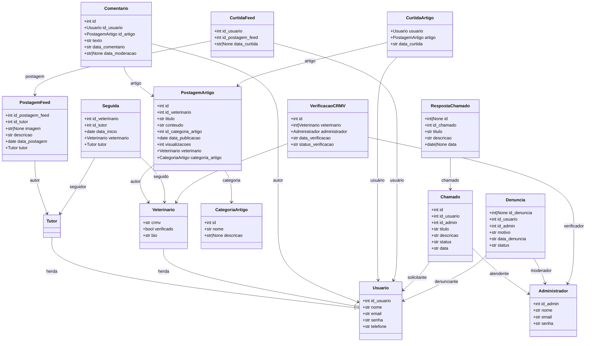

# Diagrama de Classes - VetConecta

## Visão Geral
Este diagrama representa a estrutura de classes do sistema VetConecta, um portal web que conecta tutores de pets a veterinários.

## Diagrama de Classes em Mermaid

## Descrição das Classes

### Classes de Usuário
- **Usuario**: Classe base para todos os tipos de usuários do sistema
- **Tutor**: Herda de Usuario, representa donos de pets
- **Veterinario**: Herda de Usuario, possui informações profissionais (CRMV, bio, status de verificação)
- **Administrador**: Usuário administrativo do sistema (não herda de Usuario)

### Classes de Conteúdo
- **PostagemArtigo**: Artigos escritos por veterinários, categorizados
- **PostagemFeed**: Posts do feed social criados por tutores
- **CategoriaArtigo**: Categorização para artigos veterinários

### Classes de Interação
- **Comentario**: Comentários em artigos
- **CurtidaArtigo**: Curtidas em artigos
- **CurtidaFeed**: Curtidas em posts do feed
- **Seguida**: Relacionamento de seguir entre tutores e veterinários

### Classes Administrativas
- **Chamado**: Tickets de suporte
- **RespostaChamado**: Respostas aos chamados
- **Denuncia**: Denúncias de conteúdo/usuários
- **VerificacaoCRMV**: Processo de verificação de registro veterinário

## Observações
- O sistema possui clara separação entre conteúdo de feed (social) e artigos (profissional)
- Existe um sistema completo de moderação com denúncias e verificação de credenciais
- Os relacionamentos mostram um sistema de rede social especializada para o contexto veterinário